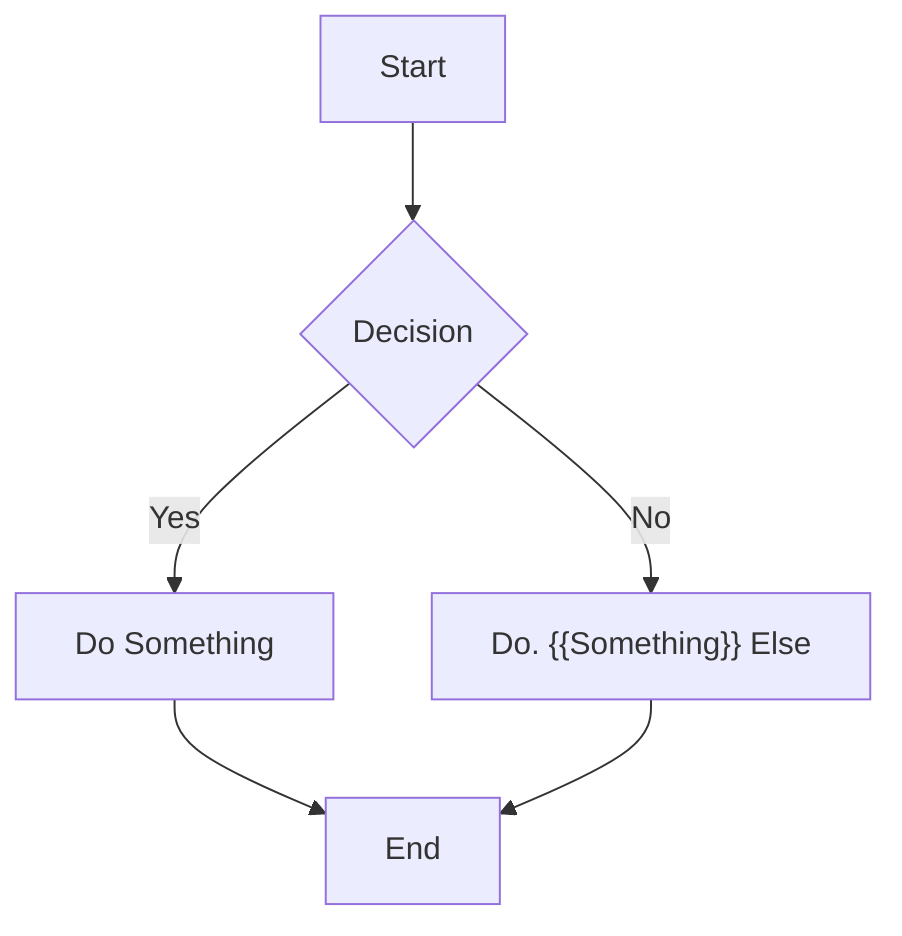

# GPT Breeze Implementation Plan: [Feature/Task Name]

* **Process:**
  * The user describes their initial need or idea.
  * As the architect, ask focused questions to clarify the user's goals, expected outcomes, and user experience—avoid technical jargon.
  * Ensure all functional and UX requirements are clearly understood from the user's perspective.
  * As the principal engineer, document all technical considerations, constraints, and integration points based on project documentation and codebase analysis.
* **Goal:** Deliver an implementation plan that is easy to understand for both technical and non-technical stakeholders, outlining clear steps from user need to technical execution.

## 1. Understanding the Goal

* **Objective:** A clear, concise statement of what this task aims to achieve.
* **User Story / Requirement:** (Optional) The user story that this task addresses.
* **Scope:** What is included and what is *not* included in this task.

## 2. Information Gathering

This section outlines the exploration of the codebase to understand the context. As per project guidelines, this begins with the `/docs` folder.

* **Documentation Review:** Review relevant documents in the `/docs` folder to understand existing architecture and data flows.
* **Files to Read:** List of files to be read to understand the current implementation.
  * `[path/to/file1.ext]`
* **Code to Search:** Keywords or patterns to find relevant logic.
  * `[regex_or_keyword_1]`
* **Definitions to List:** High-level overview of key components.
  * `[path/to/directory1/]`

## 3. Clarifying Questions
List of questions to resolve ambiguities before implementation.
1. [Question 1?]
2. [Question 2?]
Prompt the user those questions before continuing to next steps

## 4. High-Level Plan

A strategic overview of the implementation approach.

### 4.1. Strategy

- A brief description of the chosen approach, keeping SOLID, KISS, and DRY principles in mind.
- Justification explain why this solution make sense, why it's the simplest feasible solution, it's pros and cons.
- Trade off: what key trade of we have to made here

### 4.2. Architecture & Flow Diagram (Mermaid)

**Instructions:**
- Clearly indicate which components/functions operate in the background script and which in the content script.
- Respect Chrome extension architecture constraints, especially around message passing and event handling.
- **CRITICAL EVENT HANDLING PATTERN:**  
  Never use `await` to directly receive a response from background/content script events (e.g., `const response = await Browser.runtime.sendMessage(...)`).  
  Instead, always send a follow-up event/message to handle the response.  
  This avoids breaking the extension’s message passing system—a common and critical pitfall.

**Diagram Example:**  
Use Mermaid to visually map the flow, labeling each node as [Background] or [ContentScript] as appropriate.  
Show the direction of messages/events, and explicitly note asynchronous response handling.

## 5. Detailed Implementation Steps

A sequential breakdown of the tasks required to complete the implementation. This will guide the coding phase.

1. **Step 1: [Description of Step 1]** [ ] Implementation Progress
   * **Action:** Modify file `[path/to/file.ext]`.
   * **Details:** Add new function `newFunction()` / Refactor `oldFunction()` to...
2. **Step 2: [Description of Step 2]** [ ] Implementation Progress
   * **Action:** Create new file `[path/to/new_file.ext]`.
   * **Details:** The file will contain...
3. **Step 3: [Description of Step 3]** [ ] Implementation Progress
   * **Action:** Update configuration in `[path/to/config.json]`.
   * **Details:** Add the new feature flag...
4. ...

### 5.1. Edge Case and Data Validation [ ] Implementation Progress

* **Validation:** [e.g., Input validation rules]
* **Empty States:** [e.g., How to render the component with no data]

### 5.2. Error Handling [ ] Implementation Progress

* **Potential Errors:**
  1. [API Timeout]: [Show a timeout message and a retry button]
  2. [No Permission]: [Disable the feature and show an explanatory tooltip]
* **User Feedback:**
  * **Success:** [UI change on success]
  * **Error:** [Display a clear, actionable error message]
  * **Loading:** [Show a loading spinner or skeleton screen]

#### 5.5 Key Learning, 
  * Update the critical findings that affect the decision and the implementation as you go.

## 6. Acceptance Criteria

### 6.1. Technical Checklist

- [ ] The feature is functional and tested on Chromium, Firefox, and Safari.
- [ ] All new `.scss` files are correctly imported into their corresponding `.jsx` files.
- [ ] All browser API calls use the `Browser` object from `webextension-polyfill`.
- [ ] All existing tests pass.
- [ ] New unit/integration tests for the feature are written and pass.
- [ ] Code adheres to the project's ESLint and Prettier configurations.

### 6.2. Manual Testing Checklist

* **Functionality:**
  - [ ] [Feature works as expected]
  - [ ] [Edge case 1 handled]
* **UI/UX:**
  - [ ] [Responsive design is correct]
  - [ ] [Loading and Error states display correctly]
  - [ ] [Accessibility (ARIA attributes, keyboard navigation) is considered]
* **Performance:**
  - [ ] [Response time is acceptable]

### 6.3. Dependencies & Risks

* **Dependencies:**
  - [e.g., External API, internal service]
* **Risks:**
  - [Risk 1]: [Mitigation strategy]

### 7. Documentation
- [ ] Keep update this document as you go to keep track of the implementation progress
- [ ] Add clear, purposeful inline code comments.
- [ ] After finish the implementation, Update relevant architecture or feature documents in the `/docs` folder.

---

This plan will be reviewed and approved by the user before proceeding to the implementation phase.
